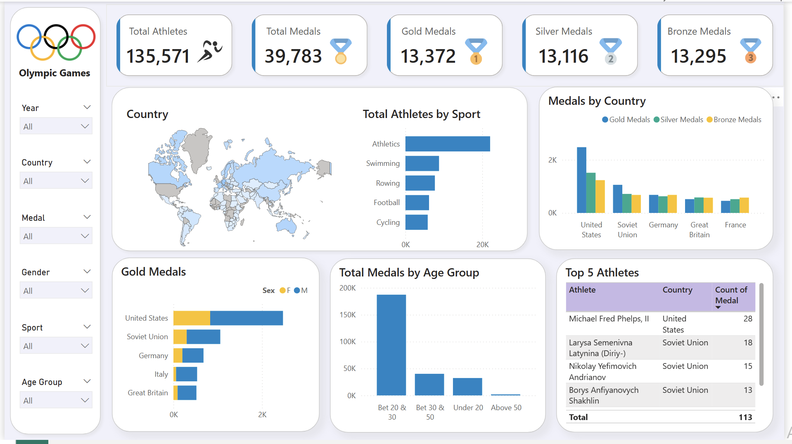

# Olympic Power BI Dashboard

This repository contains a Power BI dashboard that provides insights into Olympic athlete statistics, medal distributions, and country-wise performance.

## 📊 Dashboard Features
- Total Athletes and Medals Overview
- Medal Distribution by Country and Gender
- Gold Medals by Country and Sex
- Athlete Participation by Sport
- Medals by Age Group
- Top 5 Olympic Athletes

## 📁 Files Included
- `Olympic_Dashboard.pbix`: Power BI Dashboard File
- `athletes.csv`: Athlete dataset
- `noc_regions.csv`: NOC region mapping
- `country.json`: Country metadata
- `OlympicDashboard.png`: Dashboard screenshot

## 🚀 Getting Started
To open the dashboard:
1. Download the `.pbix` file
2. Open it with [Power BI Desktop](https://powerbi.microsoft.com/en-us/desktop/)
3. Refresh data connections if needed

## 📷 Preview

---

## 📌 Credits
Data sources derived from Olympic datasets. Visualization developed using Power BI.
